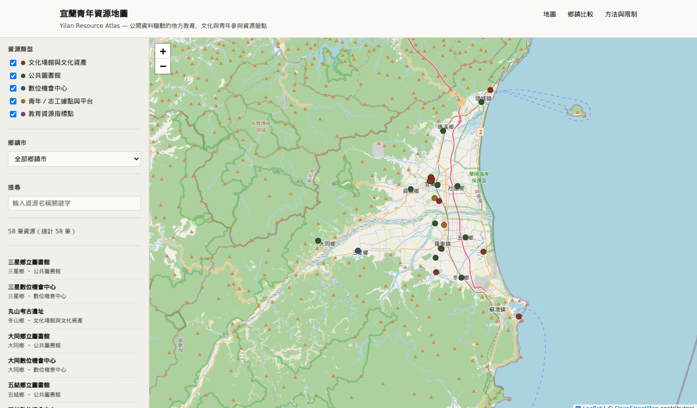

# 宜蘭青年資源地圖 Yilan Resource Atlas



整合宜蘭縣教育、文化與青年參與資源的地圖網站，讓青年志工、學生與地方組織在規劃服務前，先查到當地已經有哪些資源、分布在哪裡。

這個網站原本是蘭陽青年人文社會工作坊團隊內部使用的工具，由我負責開發，2026 年整理後公開。團隊的整體行動獲教育部第 2 屆青年志工行動競賽大專校院及社會青年組佳行獎。

- **線上網站**：[doreen1113.github.io/yilan-resource-atlas](https://doreen1113.github.io/yilan-resource-atlas/)
- **可查證**：每筆資料都附來源網址與查核日期，並標示座標的可信度
- **提醒過時**：依查核日期標示「待複查」或「過期」，讓使用者知道哪些資料需要重新確認
- **可持續維護**：有開放 API 的資料每週自動更新，變動會先開 Pull Request 經人工確認再合併

目前涵蓋宜蘭縣 12 鄉鎮市的教育、文化、圖書館、數位機會中心與青年志工資源。

## 資料處理方式

1. 資料來自政府機關的公開網頁與開放資料 API，每一筆都人工核對名稱、地址、來源網址與最後更新時間，並記錄查核日期。
2. 座標依可信度分三種標記：官方公布座標（2 筆）、僅有地址而以 OpenStreetMap Nominatim 概略定位（25 筆，多為路名或地標層級）、線上平台沒有實體地址（31 筆）。
3. 查不到的資料會記錄為缺口，不自行推估。例如 2026 年 9 月查核時，宜蘭縣開放資料平台無法連線，部分鄉鎮的資料因此尚未收錄。
4. 鄉鎮比較表只反映目前查得到的公開資料，網站上註明它不能代表實際的資源供給或服務品質。
5. 教育資源指標點使用的偏遠地區學校分級是 104 學年度（2015）的資料，網站上已標示為歷史資料。

欄位定義見 [`data/resources.schema.md`](data/resources.schema.md)，完整說明見網站的「方法與限制」頁。

## 資料更新

依資料來源分兩種維護方式：

- **有開放 API 的資料**（目前為文化部博物館資料）：`scripts/update_museums.py` 重新查詢 API 並比對宜蘭縣清單，只更新這個來源負責的資料列。GitHub Actions 每週一凌晨自動執行；資料有變動時會開 Pull Request，經人工檢查後再合併，因為 API 沒有提供鄉鎮欄位，新據點需要人工補上。
- **需要人工查證的資料**（圖書館、數位機會中心、志工平台、教育資源指標點）：無法自動更新，網站會依查核日期提示新鮮度，超過 30 天標示「待複查」，超過 90 天標示「過期」，提醒使用者哪些資料需要重新確認。

手動執行更新：

```bash
python scripts/update_museums.py
```

## 本機執行

瀏覽器會擋下以 `file://` 讀取本機 JSON，需要透過 HTTP server 開啟：

```bash
python -m http.server 8765
# 開啟 http://127.0.0.1:8765/index.html
```

## 目錄結構

```
yilan-resource-atlas/
├── index.html
├── css/style.css
├── js/app.js                   # 讀取資料，繪製地圖、篩選與比較表
├── data/
│   ├── resources.json          # 資源主表
│   ├── townships.json          # 12 鄉鎮市人口與面積
│   └── resources.schema.md     # 欄位定義
├── scripts/update_museums.py   # 博物館資料自動更新
└── .github/workflows/update-museums.yml
```

## 回報與補充

發現資料錯誤、失效連結，或有尚未收錄的公開資源，歡迎開 GitHub Issue。
